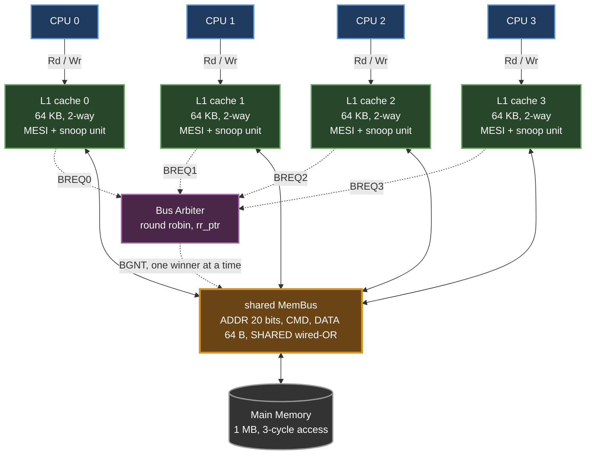
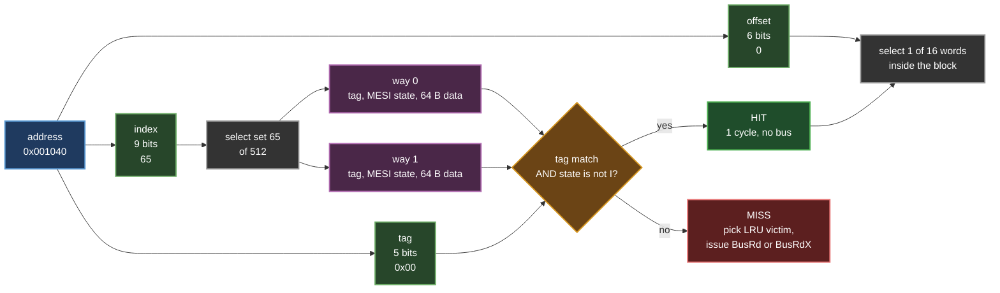
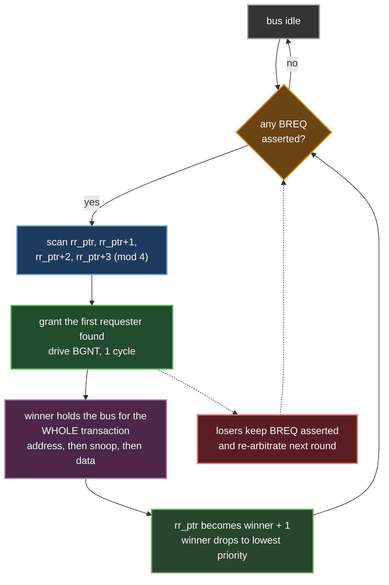
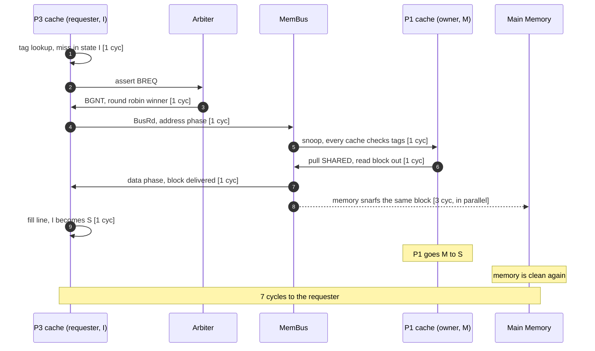
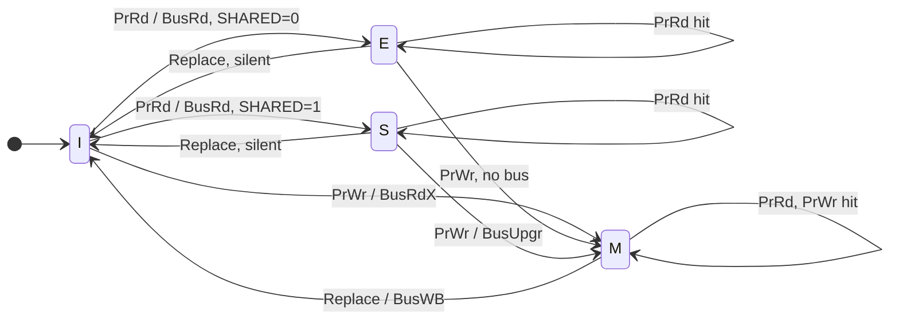
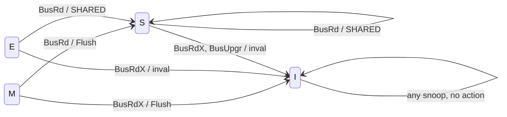

# MESI Snooping Cache Coherence Simulator

A simulator for a 4-processor shared-memory machine that keeps its caches
coherent using the MESI write-invalidate snooping protocol over a single
shared bus. Written in C/C++ with a full-screen terminal dashboard so you can
actually watch the protocol work instead of reading a wall of log lines.

This is Part 1 of a two-part cache coherence project. Part 2 replaces the
shared bus with a directory-based scheme over a point-to-point network and
lives in its own repository.

---

## Why this exists

Four processors, four private L1 caches, one shared memory. The instant two
caches hold the same block and one processor writes to it, the other cache is
holding stale data and doesn't know it. Cache coherence is the set of rules
that prevents that, and snooping is one way to enforce them: there is exactly
one bus, every cache watches every transaction on it, and reacts to the ones
that touch a block it is holding.

I wanted something I could step through one request at a time and see the
whole machine at once, so the simulator draws a live dashboard: the request,
the bus and arbiter, all four caches, a per-block coherence matrix, and a
scrolling event log.

---

## Building

You need `g++`. I built this with MinGW-w64 from MSYS2 on Windows 11, and it
compiles clean with `-Wall` on GCC and Clang on Linux/macOS too.

```
make            # builds mesi_sim
make run        # build and run
make clean
```

On Windows without make, `build.bat` does the same thing. If it can't find
`g++`, add MinGW to your PATH first:

```
set PATH=C:\msys64\mingw64\bin;%PATH%
```

### Running it

```
mesi_sim
```

**Resize your terminal to at least 100x38 before starting.** The dashboard is
drawn exactly 100 columns wide and roughly 36 rows tall. Anything narrower and
the panels wrap and it looks like garbage.

| flag | effect |
|---|---|
| *(none)* | full colour with box-drawing characters. Use this for a demo. |
| `--ascii` | plain `+ - \|` instead of Unicode box-drawing |
| `--no-color` | strips every ANSI escape including screen clearing, so the output becomes a plain scrolling transcript |
| `--auto` | runs the whole test suite, prints coverage and statistics, exits |

To capture a transcript for a writeup:

```
mesi_sim --auto --no-color --ascii > transcript.txt
```

Regardless of flags, every event is also appended to `run_log.txt` as it
happens. I added that because the full-screen dashboard overwrites itself and
I kept losing the interesting part of a run off the top of the scrollback.

---

## Menu

```
1   run the test vector suite, one step at a time
2   run the test vector suite straight through
3   interactive shell  (type your own reads and writes)

4   architecture, parameters and assumptions
5   the two MESI state diagrams
6   test vector table

7   transition coverage report
8   statistics
9   reset the machine
0   quit
```

Option 1 is the one to start with. It runs 24 test vectors, pausing after each
one with a note explaining what that step is meant to demonstrate. Press `a`
to let the rest run without pausing, `q` to stop.

### Interactive shell

```
p0 r 1040                 P0 reads address 0x1040
p1 w 1040 deadbeef        P1 writes 0xdeadbeef to 0x1040
p0 r 1040 ; p1 w 1040     both issued in the SAME cycle, so the arbiter has to pick an order
dump 2                    list the valid lines in P2's cache
mem 1040                  what main memory holds there right now
cov / stats / diag / cfg  the report screens
reset / help / quit
```

Addresses and values are hex, with or without the `0x`. The semicolon is the
interesting part: it's how you create real bus contention by hand.

---

## The machine



Solid arrows carry data, dotted arrows are the arbitration handshake. Every
cache is wired to the bus both ways, because it is not only a master issuing
its own transactions but also a snooper watching everyone else's.

| parameter | value |
|---|---|
| processors | 4 |
| L1 per processor | 64 KB, 2-way set associative, 64-byte blocks, LRU, write-back, write-allocate |
| sets per L1 | 64 KB / (64 B x 2 ways) = 512 |
| shared main memory | 1 MB, so a 20-bit physical address |
| interconnect | one shared MemBus, atomic transactions |
| coherence | MESI, write-invalidate, snooping |

The L1 geometry is the Opteron data cache from Figure B.5 of Hennessy &
Patterson, which is what the assignment specifies.

### Address breakdown

```
  19                 15 14                  6 5                  0
 +---------------------+----------------------+--------------------+
 |    tag    (5 bits)  |    index   (9 bits)  |   offset  (6 bits) |
 +---------------------+----------------------+--------------------+
```

And this is the lookup path that breakdown drives:



The `state is not I` half of that comparison is the part people forget. A tag
can match while the line sits in Invalid, which is a miss, but it also means
the frame is already ours to reuse without evicting anything.

Two addresses collide in the same set when they're 32 KB apart (64-byte block
x 512 sets). I leaned on this when picking test addresses: `0x001040`,
`0x009040` and `0x011040` all map to set 65 with tags 0, 1 and 2. A 2-way set
can't hold all three, which is the only way to reach the replacement arcs of
the state diagram.

### Bus lines I modelled

| line | purpose |
|---|---|
| `ADDR[19:0]` | block address of the transaction |
| `CMD` | `BusRd`, `BusRdX`, `BusUpgr`, `BusWB` |
| `DATA` | one 64-byte block |
| `SHARED` | wired-OR, pulled by any snooper still holding a valid copy |
| `BREQ[i]` / `BGNT[i]` | private request/grant pair between cache i and the arbiter |

`SHARED` is the line that makes the E state possible. A read miss ends in E
when `SHARED` stays low, meaning nobody else has the block, and in S when some
other cache pulls it. Without that one wire you'd have MSI, not MESI.

---

## Bus arbiter design

The arbiter is in `bus.h` (the full design writeup is in the header comment)
and `bus.cpp`.

### Topology

Centralised and synchronous. Every cache controller gets its own private pair
of wires to the arbiter:

```
   BREQ[i]   cache i  --->  arbiter      "I want the bus"
   BGNT[i]   arbiter  --->  cache i      "the bus is yours"
```

I used one dedicated pair per master rather than a shared daisy chain. A daisy
chain is cheaper in wires, but it hard-wires priority to physical position,
which is exactly the starvation problem I was trying to avoid. With dedicated
lines the arbiter sees all four requests in the same cycle and can be fair
between them.

### Policy: round robin with rotating priority

The arbiter holds a pointer `rr_ptr`. To arbitrate it walks

```
   rr_ptr, rr_ptr+1, rr_ptr+2, rr_ptr+3   (mod 4)
```

and grants the first master with `BREQ` asserted. Right after granting master
`g`:

```
   rr_ptr  <-  (g + 1) mod 4
```

so whoever just won drops to lowest priority for the next round.



I picked round robin over fixed priority for one concrete reason: with fixed
priority, P0 in a tight loop can starve P3 forever. With rotating priority any
requester can be passed over at most 3 times before it has to win, so the
worst-case wait is bounded at 3 bus tenures and starvation is structurally
impossible. It costs almost nothing to build, just a 2-bit counter and a 4-bit
priority-encoded scan, with no per-master state.

The statistics screen reports both grants and "passed over" counts per
processor, so you can see the fairness in the numbers rather than take my word
for it.

### The bus is atomic, and that matters

Arbitration takes 1 cycle. The winner then holds the bus for the entire
transaction:

```
   address phase  ->  snoop phase  ->  data phase  ->  release
```

This is the single most important decision in the whole design. Because no
second transaction for the same block can interleave between my snoop and my
data, the protocol needs no transient states at all. The state machines in the
code are exactly the two diagrams from the lecture notes with nothing extra
bolted on. If I had made the bus split-transaction, I'd have needed a pile of
intermediate states to cover the windows where a block is in flight.

### What contention actually costs

While a master waits for the bus, somebody else's transaction can change its
state underneath it. A cache that planned a `BusUpgr` because it held the
block in S can find itself in I by the time it's granted, and at that point a
`BusUpgr` is illegal, it has to issue a `BusRdX` instead.

I handle this by re-evaluating the transaction at grant time rather than at
request time. The change gets logged and flagged on the dashboard as
"re-planned after losing arbitration". Test vector 23 forces it to happen
deterministically.

This is the full path a step takes, re-plan included:

```mermaid
flowchart LR
    START["1 to 4 requests<br/>arrive same cycle"]:::start
    START --> TAG["all caches tag-lookup<br/>in parallel, 1 cyc"]:::step
    TAG --> HIT{"hit?"}:::dec
    HIT -->|yes| DONE["done, no bus<br/>1 cycle total"]:::good
    HIT -->|no| BREQ["assert BREQ,<br/>record planned cmd"]:::step
    BREQ --> GRANT["arbiter grants<br/>one master, 1 cyc"]:::grant
    GRANT --> CHECK{"state changed<br/>while waiting?"}:::dec
    CHECK -->|"S became I"| REPLAN["RE-PLAN<br/>BusUpgr to BusRdX"]:::warn
    CHECK -->|no| TXN
    REPLAN --> TXN["run transaction<br/>evict, addr, snoop,<br/>data, fill"]:::step
    TXN --> MORE{"BREQ still<br/>asserted?"}:::dec
    MORE -->|yes| GRANT
    MORE -->|no| END["step complete"]:::good

    classDef start fill:#1f3a5f,stroke:#5b9bd5,stroke-width:2px,color:#ffffff
    classDef step fill:#333333,stroke:#999999,stroke-width:2px,color:#ffffff
    classDef dec fill:#6b4415,stroke:#d4941e,stroke-width:2px,color:#ffffff
    classDef grant fill:#4a2748,stroke:#b06ab0,stroke-width:2px,color:#ffffff
    classDef warn fill:#5c1f1f,stroke:#e57373,stroke-width:3px,color:#ffffff
    classDef good fill:#1f4d2b,stroke:#4caf50,stroke-width:2px,color:#ffffff
```



This was the one part of the protocol I got wrong on the first attempt, and
it's the reason I built the concurrent-request mechanism in the first place.

---

## Timing model

The four constants come from the assignment:

| | cycles |
|---|---|
| cache access | 1 |
| main memory access | 3 |
| MemBus latency, after the arbiter grants | 1 |
| bus arbitration | 1 |

Which produce these access latencies:

| access | breakdown | cycles |
|---|---|---|
| read or write hit | cache | 1 |
| write hit in S (`BusUpgr`) | cache + arb + bus + snoop + cache write | 5 |
| miss, memory supplies | cache + arb + bus + snoop + mem + bus + fill | 9 |
| miss, another cache flushes | cache + arb + bus + snoop + cache + bus + fill | 7 |
| dirty victim adds a write-back | bus + mem | +4 |

Here is where those 7 cycles actually go on a read miss that another cache
services. This is test vector 9, the P3 read that catches P1 dirty in M:



The dashed arrow is the part that makes this cheaper than going to memory.
Those 3 memory cycles are real, but they are memory *occupancy*, not requester
stall, so they never appear in the 7.

Cache-to-cache transfer beats going to memory because memory snarfs the
flushed block off the bus in parallel. Those 3 memory cycles are memory
occupancy, not requester stall, so they don't sit on the critical path.

---

## Assumptions

These are also on screen under menu option 4.

1. **The bus is atomic.** The arbitration winner holds it for the whole
   transaction, so no other request for the same block can interleave. This is
   what keeps the protocol free of transient states.
2. **`SHARED` is a wired-OR line** driven by every cache still holding a valid
   copy. A read miss ends in E when it stays low and S when it's pulled.
3. **Only a cache in M supplies data** via Flush. E and S copies are clean, so
   main memory answers those misses. This is the conservative textbook choice.
   Supplying from E as well would be a legal optimisation and would change the
   latency numbers, but I wanted the simpler rule I could defend.
4. **A Flush does two things at once:** hands the block to the requester and
   brings memory up to date, so memory is clean afterwards and both caches can
   sit in S.
5. **S to M uses `BusUpgr`, not `BusRdX`.** The data is already here, only the
   other copies need killing, so there's no data phase. A `BusUpgr` can only
   ever find copies in S, because the cache issuing it was itself in S, which
   means by definition nobody held the block in E or M.
6. **A dirty victim is written back inside the same bus tenure** as the miss
   that displaced it. That's one write-back buffer per cache.
7. **Processors are not simulated.** Read and Write requests are injected
   straight into the cache controllers, which the assignment explicitly allows.
8. **One 32-bit word is read or written per request.** The cache still moves
   whole 64-byte blocks on the bus.
9. **Replacement is LRU**, and among invalid ways the one idle longest is
   picked first, so a never-used way gets taken before a temporarily invalid
   one. This detail matters more than it sounds, see the note at the bottom.

---

## The two state diagrams

Both are on screen under option 5. `mesi.cpp` contains them written out as a
table, and that table is effectively the specification the implementation is
checked against.

### Locally initiated accesses

What this processor's own reads and writes do to its own line.



The one arc worth staring at is `E --> M`, because it is the only way into M
that costs nothing. E exists purely so that arc can exist, and E is only
reachable because the SHARED line told us nobody else had the block.

| from | event | action | to |
|---|---|---|---|
| I | PrRd, `SHARED` low | issue `BusRd` | E |
| I | PrRd, `SHARED` pulled | issue `BusRd` | S |
| I | PrWr | issue `BusRdX` | M |
| S | PrRd | read hit, no bus | S |
| S | PrWr | issue `BusUpgr` | M |
| S | Replace | silent, block is clean | I |
| E | PrRd | read hit, no bus | E |
| E | PrWr | silent upgrade, no bus | M |
| E | Replace | silent, block is clean | I |
| M | PrRd | read hit, no bus | M |
| M | PrWr | write hit, no bus | M |
| M | Replace | write the block back (`BusWB`) | I |

### Remotely initiated (snooped) accesses

What a transaction issued by *somebody else* does to our line. We never asked
for any of these.

Every transition below is triggered by a transaction we snooped off the bus,
not by anything our own processor did.



`Flush` appears on exactly the two arcs leaving M, and nowhere else. That is
assumption 3 made visible: only a dirty owner ever puts data on the bus,
because E and S copies are clean and memory can answer those itself.

| from | snooped `BusRd` | | snooped `BusRdX` / `BusUpgr` | |
|---|---|---|---|---|
| M | Flush, memory updated | -> S | Flush | -> I |
| E | assert `SHARED` | -> S | invalidate | -> I |
| S | assert `SHARED` | -> S | invalidate | -> I |
| I | no action | -> I | no action | -> I |

20 arcs in total, 12 local and 8 remote.

---

## Test vectors

Defined in `tests.cpp`, and menu option 6 prints this table from the running
program so it can't drift out of sync with the code.

### Addresses

| name | address | set | tag | why this one |
|---|---|---|---|---|
| A | `0x001040` | 65 | 0 | the main block under test |
| B | `0x009040` | 65 | 1 | collides with A |
| C | `0x011040` | 65 | 2 | third tag, forces eviction from a 2-way set |
| D | `0x002080` | 130 | 0 | different set, used for the arbitration tests so it can't disturb the replacement sequence |

### The vectors

| # | requests | what it's meant to take |
|---|---|---|
| 1 | P0 RD A | `I --PrRd--> E` |
| 2 | P0 RD A | `E --PrRd--> E` |
| 3 | P1 RD A | `I --PrRd--> S` and remote `E --BusRd--> S` |
| 4 | P1 RD A | `S --PrRd--> S` |
| 5 | P2 RD A | remote `S --BusRd--> S` |
| 6 | P1 WR A | `S --PrWr--> M` and remote `S --BusUpgr--> I` |
| 7 | P1 WR A | `M --PrWr--> M` |
| 8 | P1 RD A | `M --PrRd--> M` |
| 9 | P3 RD A | remote `M --BusRd--> S` and `I --snoop--> I` |
| 10 | P2 WR A | `I --PrWr--> M` and remote `S --BusRdX--> I` |
| 11 | P0 RD B | `I --PrRd--> E` |
| 12 | P0 WR B | `E --PrWr--> M` |
| 13 | P3 WR B | remote `M --BusRdX--> I` |
| 14 | P1 RD D | `I --PrRd--> E` |
| 15 | P2 WR D | remote `E --BusRdX--> I` |
| 16 | P0 RD A | remote `M --BusRd--> S` |
| 17 | P0 RD B | remote `M --BusRd--> S`, and P0's set 65 is now full |
| 18 | P0 RD C | `S --Replace--> I` then `I --PrRd--> E` |
| 19 | P0 WR B | `S --PrWr--> M` |
| 20 | P0 RD A | `E --Replace--> I` |
| 21 | P0 RD C | `M --Replace--> I` with a `BusWB` |
| 22 | P0,P1,P2,P3 RD D, same cycle | P2 hits in M and never touches the bus, the other three contend and round robin serialises them |
| 23 | P0,P1,P2 WR A, same cycle | at least one loser has to re-plan its `BusUpgr` into a `BusRdX` |
| 24 | P3 RD A | remote `M --BusRd--> S` and a final data correctness check |

Vectors 1 through 21 are there to reach every arc. Vectors 22 through 24 are
there to stress the arbiter and the re-plan path, which is where I expected
bugs and found one.

---

## Proving it works

There are two separate checks, because they prove different things.

### Coverage

Every time the simulator takes an arc it calls `cov_hit()`. Menu option 7
prints the result. Running the suite gives:

```
DIAGRAM 1  -  LOCALLY INITIATED ACCESSES
from  event                 action                to    times   covered
I     PrRd, no sharer       issue BusRd           E     5       yes
I     PrRd, sharer(s)       issue BusRd           S     10      yes
I     PrWr                  issue BusRdX          M     6       yes
S     PrRd                  read hit, no bus      S     1       yes
S     PrWr                  issue BusUpgr         M     2       yes
S     Replace               silent, block clean   I     1       yes
E     PrRd                  read hit, no bus      E     1       yes
E     PrWr                  silent upgrade        M     1       yes
E     Replace               silent, block clean   I     1       yes
M     PrRd                  read hit, no bus      M     2       yes
M     PrWr                  write hit, no bus     M     1       yes
M     Replace               write back block      I     1       yes

DIAGRAM 2  -  REMOTELY INITIATED ACCESSES
from  event                 action                to    times   covered
S     snoop BusRd           assert SHARED         S     8       yes
S     snoop BusRdX          invalidate            I     4       yes
S     snoop BusUpgr         invalidate            I     3       yes
E     snoop BusRd           assert SHARED         S     1       yes
E     snoop BusRdX          invalidate            I     1       yes
M     snoop BusRd           Flush + SHARED        S     5       yes
M     snoop BusRdX          Flush, invalidate     I     3       yes
I     snoop any txn         no action             I     14      yes

local diagram  12 of 12 arcs        remote diagram  8 of 8 arcs
ALL TRANSITIONS OF BOTH STATE DIAGRAMS WERE ACTIVATED.
```

### Correctness

Coverage only proves an arc was taken. It says nothing about whether the
protocol handed out the right data, so there's a second check. The simulator
keeps a golden copy of memory: every processor write updates it, and every
processor read is compared against it. A single mismatch means a cache served
stale data, and it gets logged as a `COHERENCE VIOLATION` in red.

The suite does 19 reads with 0 mismatches.

I think this second check is the more valuable of the two. It's easy to write
a broken protocol that still touches all 20 arcs.

### Run summary

```
188 cycles simulated
BusRd 15   BusRdX 6   BusUpgr 2   BusWB 1
bus busy 141 of 188 cycles  ->  utilisation 75%
arbitrations 23, of which 4 had more than one requester
grants        P0 10   P1 5   P2 4   P3 4
passed over   P0 4    P1 0   P2 1   P3 1
```

75% bus utilisation with only four processors is a good illustration of why
snooping doesn't scale, and it's most of the motivation for the directory
scheme in Part 2.

---

## Code layout

| file | what's in it |
|---|---|
| `config.h` | every architectural parameter and timing constant, in one place |
| `mesi.h` / `mesi.cpp` | the four states, the 20-arc transition table, coverage counters |
| `cache.h` / `cache.cpp` | one L1: address decode, tag lookup, LRU victim selection |
| `bus.h` / `bus.cpp` | the MemBus and the arbiter. Design writeup is in the header. |
| `memory.h` / `memory.cpp` | the 1 MB shared memory, block-granular transfers |
| `sim.h` / `sim.cpp` | the protocol itself: both state diagrams, arbitration loop, timing |
| `screens.cpp` | everything that goes on screen |
| `ui.h` / `ui.cpp` | terminal drawing, ANSI colour, UTF-8-aware column alignment |
| `tests.h` / `tests.cpp` | the test vector suite and the vector table |
| `main.cpp` | menu and interactive shell |

I deliberately kept the protocol and the presentation in separate files. You
can read `sim.cpp` on its own and check it line by line against the lecture
diagrams without any drawing code in the way.

---

## Diagrams

The architecture diagrams above are Mermaid blocks, so GitHub renders them
live and they stay diffable in version control. `docs/diagrams/` holds the
same seven as PNGs plus their extracted `.mmd` sources, for pasting into a
report where Mermaid won't render.

| file | what it shows |
|---|---|
| `01-system-architecture` | the whole machine: CPUs, caches, arbiter, bus, memory |
| `02-cache-lookup` | how an address becomes a hit or a miss |
| `03-bus-arbiter` | the round-robin arbitration loop |
| `04-step-flow` | one simulation step, including the re-plan path |
| `05-read-miss-timeline` | where the 7 cycles of a cache-to-cache miss go |
| `06-mesi-local` | locally initiated state diagram, 12 arcs |
| `07-mesi-remote` | remotely initiated state diagram, 8 arcs |

The PNGs are generated from the README, not maintained separately, so they
can't drift out of sync. To rebuild them after editing a diagram:

```
npm install @mermaid-js/mermaid-cli
mmdc -i docs/diagrams/06-mesi-local.mmd -o docs/diagrams/06-mesi-local.png -b white -s 2
```

A note on layout, since it cost me some time: Mermaid's auto-layout is fussy
about long edge labels. Anything much over about 25 characters starts
colliding with neighbouring arrows, and a tall `flowchart TD` with a loop in
it can come out 3800 pixels high. Shortening labels and switching the step
flow to `flowchart LR` took that one from 1246x3820 down to 1568x190.

---

## Notes and things worth knowing

**LRU among invalid ways.** My first version of `cache_victim` returned the
first invalid way it found. That looks harmless, but it meant one way of a set
got reused over and over while the other sat untouched, and the set never
filled up, so I could never trigger a replacement no matter what addresses I
threw at it. Picking the invalid way that's been idle longest fixes it. This
is why assumption 9 exists.

**Column alignment with Unicode.** `printf("%-20s")` counts bytes, not display
columns, so the moment you put a box-drawing character in a string all your
tables skew. `ui_vislen()` in `ui.cpp` counts UTF-8 lead bytes and skips ANSI
escape sequences, and everything pads through that instead. All 92 box lines
in a full run come out at exactly 100 columns.

**Windows console.** ANSI escapes do nothing on Windows until you call
`SetConsoleMode` with `ENABLE_VIRTUAL_TERMINAL_PROCESSING`, and box-drawing
characters need `SetConsoleOutputCP(CP_UTF8)`. Both happen in `ui_init()`.
`--ascii` is the fallback if your terminal still won't cooperate.

**Known limitations.** The bus is atomic, so there's no split-transaction
modelling and no overlap between transactions. Only M supplies data, so E-state
cache-to-cache transfers aren't modelled. There's no L2 and no memory
controller queueing. All of these were deliberate scope choices, not oversights
- the goal was a protocol simulator I could verify against the state diagrams,
not a full memory system model.
